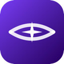

# BlindSpot



[](https://github.com/Nainounen/blind-spot/releases/latest)
[](https://github.com/Nainounen/blind-spot/releases/latest)
[](https://swift.org)
[](LICENSE)

AI answers for anything you select — invisible to screen recorders.

Select any text, press **⌘⇧Space**, and an answer streams back in a floating overlay that no screenshot tool or screen recording can capture.

---

## Install

### Download

1. Go to the [latest release](https://github.com/Nainounen/blind-spot/releases/latest)
2. Download `BlindSpot-<version>.dmg`
3. Open the DMG and drag **BlindSpot** onto the **Applications** folder
4. First launch: right-click `BlindSpot` in Applications → **Open** → **Open**

That last step is a one-time workaround. BlindSpot isn't notarized with Apple yet, so macOS shows a security prompt the first time. After that, double-clicking works normally.

### Homebrew

```bash
brew tap Nainounen/blindspot
brew install --cask blindspot
```

Homebrew skips the first-launch prompt automatically. To update:

```bash
brew update && brew upgrade --cask blindspot
```

**Requires macOS 14 Sonoma or later. Works on Apple Silicon and Intel Macs.**

---

## Setup

On first launch, BlindSpot walks you through three steps:

1. **Choose a provider** — OpenAI, Anthropic, Gemini, DeepSeek, Grok, or Ollama (runs locally, no key needed)
2. **Paste your API key** — saved on your Mac only, never sent anywhere except your chosen provider
3. **Allow Accessibility access** — lets the app read your selected text and listen for the hotkey

Once done, the **✦** icon appears in your menu bar. Select any text anywhere and press **⌘⇧Space**.

---

## AI providers

| Provider | Default model | API key |
|---|---|---|
| OpenAI | GPT-4o | [platform.openai.com/api-keys](https://platform.openai.com/api-keys) |
| Anthropic | Claude Sonnet | [console.anthropic.com/settings/keys](https://console.anthropic.com/settings/keys) |
| Google Gemini | Gemini 2.5 Flash | [aistudio.google.com/app/apikey](https://aistudio.google.com/app/apikey) |
| DeepSeek | DeepSeek Chat | [platform.deepseek.com/api_keys](https://platform.deepseek.com/api_keys) |
| xAI Grok | Grok 3 | [console.x.ai](https://console.x.ai) |
| Ollama | Llama 3.2 | No key — runs entirely on your Mac |

Switch providers at any time from the **✦** menu.

---

## Privacy

- API keys are stored locally at `~/.config/blind-spot/keys/` and sent only to your chosen provider
- Selected text goes to your provider's API to generate a response, subject to their privacy policy
- The answer overlay is excluded from screen capture via `NSWindowSharingNone`, which operates at the compositor level — it does not appear in screenshots, ScreenCaptureKit recordings, or video calls (Zoom, Teams, Meet, etc.). On macOS 14.4+, the system screen picker also hides the window entirely, so it cannot be accidentally selected when sharing your screen
- BlindSpot has no Dock icon and collects no data of its own

**Limitations:** The overlay is not protected against `CGDisplayCreateImage` or Accessibility API captures made by apps that already hold Screen Recording permission. A physical camera pointed at your display is also unaffected.

---

## Contributing

See [CONTRIBUTING.md](CONTRIBUTING.md) for how to build from source and submit changes.
