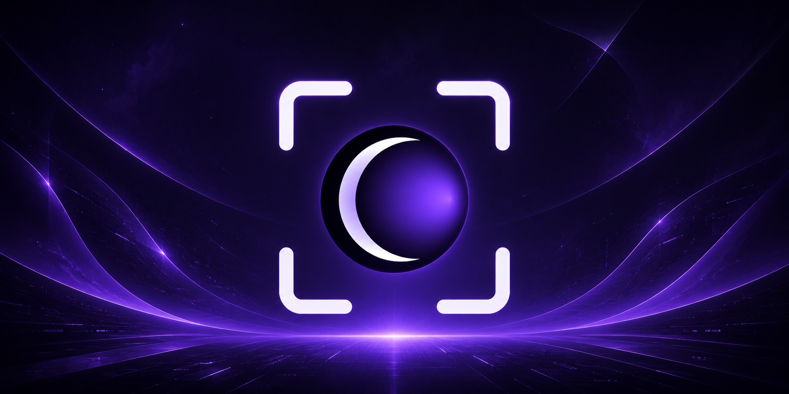

  

<h1 align="center">BlindSpot</h1>

  <em>AI answers for anything you select — invisible to screen recorders.</em>

  
  
  
  

Select any text, press **⌘⇧Space**, and an answer streams back in a floating overlay that no screenshot tool or screen recording can capture. Press **⌘⇧⌥Space** to include a screenshot for visual context.

---

## Install

1. Go to the [latest release](https://github.com/Nainounen/blind-spot/releases/latest)
2. Download `BlindSpot-<version>.dmg`
3. Open the DMG and drag **BlindSpot** to **Applications**
4. Launch it normally

BlindSpot is signed with an Apple Developer ID and notarized by Apple, so it opens without any Gatekeeper warnings.

**Requires macOS 26 or later. Works on Apple Silicon and Intel.**

---

## Setup

On first launch, BlindSpot walks you through three steps:

1. **Choose a provider** — OpenAI, Anthropic, Gemini, DeepSeek, Grok, OpenRouter, or Ollama (local, no key needed)
2. **Paste your API key** — saved on your Mac only, never sent anywhere except your chosen provider
3. **Allow Accessibility access** — required to read selected text and listen for hotkeys
4. **Allow Screen Recording** — needed for visual context screenshot (⌘⇧⌥Space), prompted on first use

Once done, the **✦** icon appears in your menu bar.

---

<strong>What's new in v2.0</strong>

### Added — Raycast-style command panel
The overlay is now a persistent panel that opens with your hotkey and stays available throughout a session. It has a conversation sidebar with date-grouped history, folder organization, and a follow-up input field.

### Added — AI profiles
Multiple profiles, each with its own provider, model, system prompt, temperature, and token limit. Switch the active profile from the menu bar without opening Settings.

### Added — Conversation history
Every exchange is saved and searchable. Conversations can be grouped into folders, and exported as Markdown or JSON via right-click.

### Added — Conversation folders and export
Group conversations into named folders. Export a single conversation or an entire folder as Markdown or JSON from the right-click menu.

### Added — Sparkle auto-updates
BlindSpot checks for updates in the background and notifies you when one is available.

### Added — OpenRouter support
OpenRouter is now a first-class provider — one API key gives access to 100+ models from different providers.

### Added — Provider logos
The provider picker shows real brand icons instead of generic SF Symbols.

### Added — Auto-copy last response
A setting in Preferences automatically copies the AI response to your clipboard as soon as streaming completes.

### Changed — Onboarding redesign
The setup flow uses the same visual language as the panel: thin material background, glass input fields, step progress dots, and real provider icons.

### Changed — Settings redesign
Settings uses the same material and layout patterns as the command panel. Per-profile configuration (system prompt, temperature, token limit) replaces the old global settings.

### Changed — Copy button always visible
The copy button on responses is always visible as a small icon. It shows a label on hover.

### Fixed — System prompt input invisible text
Typing in the system prompt field was invisible in dark mode. Fixed by using `usesAdaptiveColorMappingForDarkAppearance` on the underlying `NSTextView`.

### Fixed — Panel auto-hide setting ignored
The "Close panel when clicking outside" setting now works correctly.

---

## Shortcuts

| Shortcut | Action |
|---|---|
| ⌘⇧Space | Ask about selected text |
| ⌘⇧⌥Space | Ask with visual context — captures a screenshot around the selection |
| ⌘N | New conversation |
| ⌘K | Focus search |
| ⌘W | Close the panel |
| ESC | Close the panel |
| ⌘⌥Q | Force-quit |

All shortcuts except panic quit are configurable in Settings → Hotkeys.

---

## Visual Context

Press **⌘⇧⌥Space** to include a screenshot of the area around your selected text. The AI sees the visual context — UI, diagrams, code layout, tables — alongside the text.

- Captures a padded region around the selection using ScreenCaptureKit
- Works with any vision-capable provider (Gemini, GPT-4o, Claude, Grok)
- Each profile can optionally route vision requests through a **different provider or model** — for example, text via DeepSeek and vision via Gemini
- Padding and minimum capture size are configurable in Settings → Preferences
- A minimap preview shows how much of your screen the capture covers

---

## AI providers

| Provider | Default model | API key |
|---|---|---|
| OpenAI | GPT-4o | [platform.openai.com/api-keys](https://platform.openai.com/api-keys) |
| Anthropic | Claude Sonnet | [console.anthropic.com/settings/keys](https://console.anthropic.com/settings/keys) |
| Google Gemini | Gemini 2.5 Flash | [aistudio.google.com/app/apikey](https://aistudio.google.com/app/apikey) |
| DeepSeek | deepseek-v4-flash | [platform.deepseek.com/api_keys](https://platform.deepseek.com/api_keys) |
| xAI Grok | Grok 3 | [console.x.ai](https://console.x.ai) |
| OpenRouter | GPT-4o (via OR) | [openrouter.ai/keys](https://openrouter.ai/keys) |
| Ollama | Llama 3.2 | No key — runs entirely on your Mac |

---

## Privacy

- API keys are stored at `~/.config/blind-spot/keys/` and sent only to your chosen provider
- Selected text goes to your provider's API; their privacy policy applies
- The overlay is excluded from screen capture via `NSWindowSharingNone` at the compositor level — it does not appear in screenshots, ScreenCaptureKit recordings, or video calls (Zoom, Teams, Meet, etc.)
- Screen Recording permission is requested only when using visual context (⌘⇧⌥Space) to capture the area around your selection
- No Dock icon. No analytics. No data collection.

### Where data is stored

| Path | Contents |
|---|---|
| `~/.config/blind-spot/keys/<provider>` | API key for each provider (mode 0600) |
| `~/.config/blind-spot/profiles.json` | AI profiles — provider, model, system prompt, temperature, token limit |
| `~/.config/blind-spot/conversations/` | Conversation history (JSON, one file per conversation) |
| `~/.config/blind-spot/system-prompt.txt` | Legacy global system prompt (migrated to profiles on first run) |
| `~/Library/Preferences/com.blind-spot.app.plist` | App preferences — active profile, hotkeys, toggles |

All data stays on your Mac. Nothing is synced or uploaded.

---

## Contributing

See [CONTRIBUTING.md](CONTRIBUTING.md) for how to build from source and submit changes.
